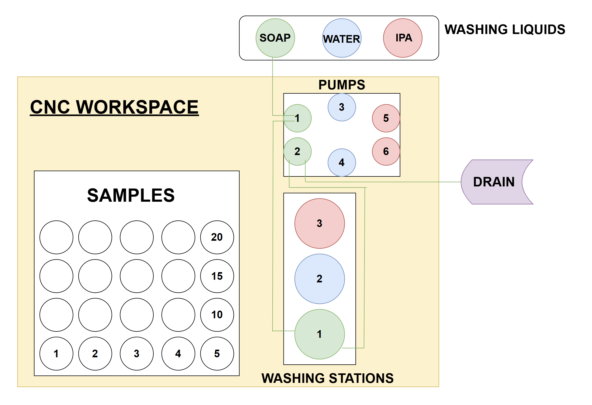
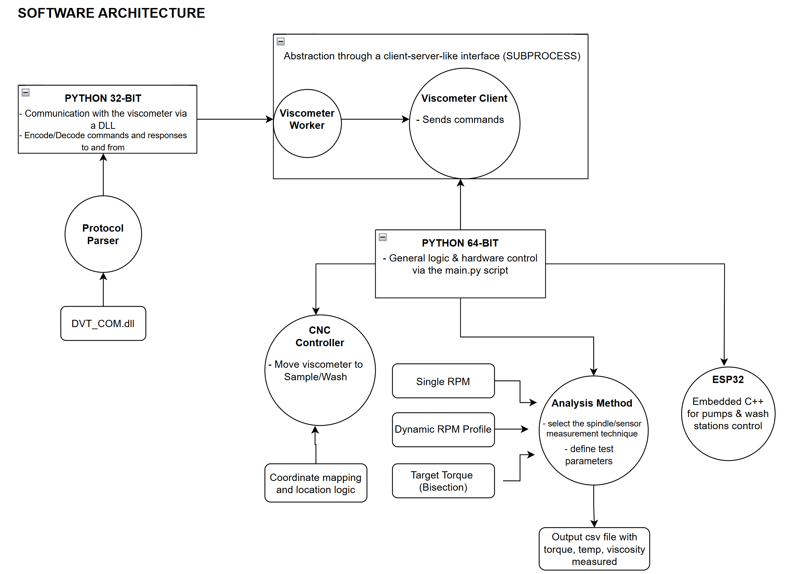
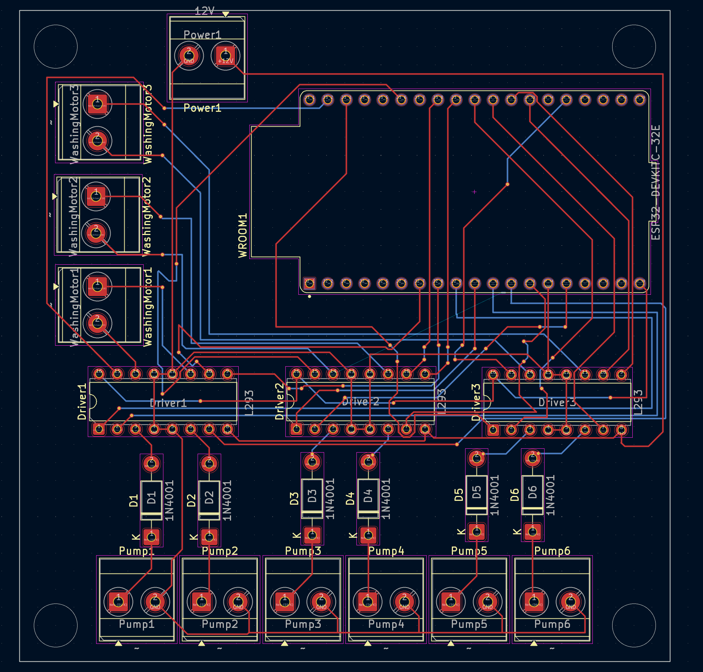
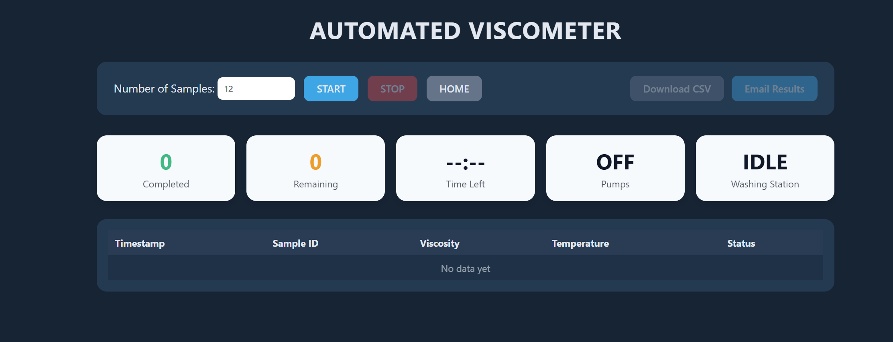

# Automated Viscosity Measurement System

An integrated robotic system for automated viscosity measurements using a Brookfield DVT viscometer, CNC machine, and automated washing stations. This system eliminates manual intervention in viscosity testing workflows, reduces contamination, and enables high-throughput rheological analysis.

## Table of Contents

- [Problem Statement](#problem-statement)
- [Solution Overview](#solution-overview)
- [System Architecture](#system-architecture)
- [Hardware Components](#hardware-components)
  - [PCB Design and Motor Control](#pcb-design-and-motor-control)
    - [Motor Driver Configuration](#motor-driver-configuration)
    - [Pump Control Specifications](#pump-control-specifications)
  - [Component List](#component-list)
- [Project Structure](#project-structure)
- [Installation and Setup](#installation-and-setup)
  - [Prerequisites](#prerequisites)
  - [Python Dependencies](#python-dependencies)
  - [Virtual Environment Setup](#virtual-environment-setup)
    - [64-bit Environment (Primary)](#64-bit-environment-primary)
    - [32-bit Environment (Viscometer Communication)](#32-bit-environment-viscometer-communication)
  - [ESP32 Firmware](#esp32-firmware)
- [System Operation](#system-operation)
  - [Washing Process](#washing-process)
  - [Movement and Positioning](#movement-and-positioning)
- [Analysis Methods](#analysis-methods)
  - [1. Single-Point Analysis](#1-single-point-analysis)
  - [2. Dynamic Analysis](#2-dynamic-analysis)
  - [3. Bisection Analysis](#3-bisection-analysis)
    - [Bisection Algorithm](#bisection-algorithm)
- [Configuration](#configuration)
  - [Main Script Configuration](#main-script-configuration)
- [Usage](#usage)
  - [Basic Operation](#basic-operation)
  - [Operational Sequence](#operational-sequence)
  - [Results](#results)
- [Future Development](#future-development)
  - [Code Reorganization](#code-reorganization)
  - [Z-Height Calibration Integration](#z-height-calibration-integration)
  - [Raspberry Pi 5 Deployment](#raspberry-pi-5-deployment)
    - [Deployment Features](#deployment-features)
- [Troubleshooting](#troubleshooting)
  - [Common Issues](#common-issues)
  - [Error Recovery](#error-recovery)
- [Contributing](#contributing)
- [License](#license)

## Problem Statement

Traditional viscosity measurements face several critical challenges:

1. **Manual Contamination Risk**: Manual spindle handling between samples can introduce contamination and measurement artifacts
2. **Low Throughput**: Manual sample handling limits the number of measurements that can be performed
3. **Inconsistent Cleaning**: Variable cleaning procedures between measurements affect reproducibility
4. **Operator Variability**: Human factors introduce inconsistencies in sample positioning and timing
5. **Limited Analysis Scope**: Manual processes restrict complex multi-point rheological studies

## Solution Overview



This automated system addresses these challenges through:

- **Robotic Sample Handling**: CNC-controlled precise positioning eliminates manual sample handling
- **Automated Washing System**: Multi-stage washing between each measurement ensures spindle cleanliness
- **High-Throughput Capability**: Automated workflow enables continuous operation across sample arrays
- **Advanced Analysis Methods**: Supports single-point, dynamic sweep, and bisection analysis modes
- **ESP32-Controlled Pump Sequencing**: Smart washing liquid flow control with PWM speed regulation

## System Architecture



The system employs a dual-architecture design:
- **Python 64-bit**: Main control logic, CNC communication, data analysis
- **Python 32-bit**: Brookfield viscometer communication (required for proprietary DLL compatibility)
- **ESP32 Microcontroller**: Pump and washing machine control with PWM motor speed regulation

## Hardware Components

### PCB Design and Motor Control



The custom PCB implements an innovative motor control strategy using L298N drivers:

#### Motor Driver Configuration
- **3 L298N Motor Drivers** controlling 9 DC motors total
- **Overloaded Channel Design**: Each L298N driver controls 3 motors instead of the standard 2
- **Channel A**: Two pumps (Pump 1 & Pump 2) with diode switching using 1N4001 diodes
- **Channel B**: One washing machine motor
- **Sequential Operation**: Pumps on Channel A operate sequentially, never simultaneously

#### Pump Control Specifications
```cpp
// Motor speeds (PWM values 0-255)
const int speedPWM_A = 170; // Pump 1 speed
const int speedPWM_B = 170; // Pump 2 speed  
const int speedPWM_C = 170; // Pump 3 speed
const int speedPWM_D = 170; // Pump 4 speed
const int speedPWM_E = 210; // Pump 5 speed
const int speedPWM_F = 210; // Pump 6 speed
const int speedPWM_G = 160; // Washer 1 speed
const int speedPWM_H = 160; // Washer 2 speed
const int speedPWM_I = 160; // Washer 3 speed
```

### Component List
- **Brookfield DVT Viscometer**: Primary measurement device
- **CNC Machine**: 3-axis robotic positioning system
- **ESP32 Development Board**: Pump and washing control
- **3x L298N Motor Driver Modules**: DC motor control
- **6x DC Pumps**: Washing liquid circulation
- **3x DC Washing Motors**: Spindle cleaning agitation
- **1N4001 Diodes**: Channel switching for dual pump control

## Project Structure

```
visc_automated_workflow_V3/
├── config/
│   └── locations.yaml          # CNC positioning coordinates
├── images/                     # System documentation images
├── results/                    # Measurement data output
├── src/
│   ├── esp32/
│   │   └── pump_wash_control.cpp    # ESP32 pump control firmware
│   ├── python_32/                   # 32-bit Python environment
│   │   ├── viscometer_protocol.py   # Viscometer communication protocol
│   │   ├── worker32.py             # JSON-RPC worker for viscometer
│   │   └── DVT_COM.dll             # Brookfield proprietary library
│   └── python_64/                   # 64-bit Python environment (main)
│       ├── main.py                 # Main execution script
│       ├── cnc_controller.py       # CNC machine control
│       ├── viscometer_client.py    # 64-bit client for viscometer
│       ├── move_to_locations.py    # Movement and washing routines
│       └── analysis_methods.py     # Viscosity analysis algorithms
```

## Installation and Setup

### Prerequisites

1. **Python Environments**: Both 32-bit and 64-bit Python installations required
2. **Hardware Connections**: CNC machine, DVT viscometer, and ESP32-WROOM 32E properly connected
3. **Serial Port Configuration**: Verify COM port assignments

### Python Dependencies

Install required packages in both environments:

```bash
# For both 32-bit and 64-bit environments
pip install pyserial
pip install pyyaml
pip install pathlib
```

### Virtual Environment Setup

#### 64-bit Environment (Primary)
```bash
python -m venv .venv64
.venv64\Scripts\activate
pip install pyserial pyyaml
```

#### 32-bit Environment (Viscometer Communication)
```bash
# Requires 32-bit Python installation
python32 -m venv .venv32  
.venv32\Scripts\activate
pip install pyserial pyyaml
```

### ESP32 Firmware
Upload `src/esp32/pump_wash_control.cpp` to ESP32 using Arduino IDE:
1. Install ESP32 board package in Arduino IDE
2. Select appropriate ESP32 board model
3. Upload the firmware with correct pin assignments
4. Contact Koketso Gaborekwe (kggabore@uwaterloo.ca) for PCB fab files

## System Operation

### Washing Process

The system performs a critical 3-stage washing sequence between each measurement:

1. **Wash Station 1**: Initial rinse with soap to remove residue 
2. **Wash Station 2**: Intermediate cleaning with fresh water  
3. **Wash Station 3**: Final rinse with IPA and drying preparation

### Movement and Positioning

The CNC system uses YAML-configured locations for precise positioning:

```yaml
main_rack_A:
  x_origin: 53
  y_origin: 135
  z_origin: -48.18
  num_x: 3
  num_y: 1
  x_offset: 80
  y_offset: 0

washing_station:
  x_origin: 275
  y_origin: 137
  z_origin: -35
  num_x: 1
  num_y: 3
  x_offset: 0
  y_offset: 80
```

## Analysis Methods

The system supports three sophisticated analysis modes:

### 1. Single-Point Analysis

Maintains constant RPM and records time-series data for steady-state characterization:

```python
RPM = 32                    # Target rotational speed
TOTAL_SECONDS = 180         # Measurement duration
SAMPLE_EVERY_SEC = 1        # Data acquisition frequency
```

**Applications**: Quality control, basic viscosity characterization, temperature stability studies

### 2. Dynamic Analysis

Sweeps through an RPM array to characterize shear-rate dependent behavior:

```python
RPMS = [2.5, 3.0, 3.5, 4.0, 4.5, 4.5, 4.5, 5.0, 5.5, 6.0]
DWELL_SECONDS = 90.0        # Equilibration time at each RPM
```

**Applications**: 
- **Shear Thinning Detection**: Observe viscosity reduction with increasing shear rate
- **Flow Behavior Index**: Calculate power-law fluid parameters
- **Thixotropic Analysis**: Study time-dependent viscosity changes

### 3. Bisection Analysis

Automatically finds the RPM that achieves a target torque value:

```python
TARGET_TORQUE_PCT = 50.0    # Target torque percentage
TOL_PCT = 5.0              # Acceptable tolerance
LOW_RPM = 0.5               # Search range minimum
HIGH_RPM = 30               # Search range maximum
MAX_ITERS = 20              # Maximum search iterations
```

**Applications**:
- **Unknown Fluid Characterization**: Ideal when viscosity range is unknown
- **Comparative Studies**: Standardized torque conditions across samples
- **Yield Stress Approximation**: Find minimum RPM for sustained rotation

#### Bisection Algorithm

The bisection method efficiently narrows the RPM range:

1. Start with wide RPM bounds [LOW_RPM, HIGH_RPM]
2. Test middle RPM value
3. If torque < target: increase lower bound
4. If torque > target: decrease upper bound  
5. Repeat until tolerance achieved or max iterations reached

## Configuration

### Main Script Configuration

Modify `src/python_64/main.py` for your setup:

```python
# Device Configuration
PYTHON32 = ".\\.venv32\\Scripts\\python.exe"
VISCO_PORT = "COM6"         # Viscometer serial port
ESP32_PORT = "COM4"         # ESP32 serial port
SPINDLE_K = 992.47          # Spindle constant (specific to spindle type)

# Analysis Selection
ANALYSIS_MODE = "single"     # "single" | "dynamic" | "bisection"
SAMPLE_RACK = "main_rack_A"  # Defined in locations.yaml
SAMPLE_RANGE = range(0, 3)   # Sample indices to measure

# Washing Control
ENABLE_WASH = True          # Enable automated washing
PUMP_VIRTUAL = False        # Set True for testing without hardware
```

## Usage

### Basic Operation

1. **Power on all hardware components**
2. **Verify serial connections**
3. **Run the main script**:

```bash
cd visc_automated_workflow_V3/src/python_64
python main.py
```

### Operational Sequence

1. **System Initialization**: CNC homes, viscometer connects, ESP32 ready
2. **Sample Loop**: For each sample in range:
   - Move to sample position
   - Perform selected analysis method
   - Save results to CSV
   - Execute 3-stage washing sequence
3. **Return Home**: CNC returns to home position
4. **System Shutdown**: All devices safely disconnected

### Results

Results are saved in structured directories:
```
results/
├── sample_000/
│   ├── single_rpm_32.00.csv
│   ├── dynamic_analysis.csv
│   └── bisection_analysis.csv
├── sample_001/
└── sample_002/
```

## Future Development

### Code Reorganization

Development is underway in the [Re-Structure branch](https://github.com/AccelerationConsortium/automated_viscosity_measurements/tree/Re-Structure) to improve code organization:

- **Modular Architecture**: Separate modules for each hardware component
- **Configuration Management**: Centralized settings and calibration
- **Enhanced Error Handling**: Robust error recovery and logging
- **API Development**: RESTful API for remote operation

### Z-Height Calibration Integration

Integration planned with [ZHeight_Control](https://github.com/gaborekweK/ZHeight_Control) repository:

- **Automatic Z-Height Detection**: Optical or contact-based surface detection
- **Adaptive Positioning**: Compensate for sample height variations
- **Calibration Routines**: Automated spindle-to-sample distance optimization

### Raspberry Pi 5 Deployment



Production deployment targeting Raspberry Pi 5:

- **Web Dashboard**: Real-time monitoring and control interface
- **Remote Operation**: Network-accessible measurement scheduling
- **Data Management**: Integrated database and analysis tools
- **Edge Computing**: Local processing and cloud synchronization

#### Deployment Features:
- **Containerized Services**: Docker-based system deployment
- **RESTful API**: Programmatic control and data access
- **Real-time Monitoring**: Live measurement feedback and alerts
- **Batch Processing**: Queue-based sample processing
- **Data Export**: Multiple format support (CSV, JSON, Excel)

## Troubleshooting

### Common Issues

1. **Serial Communication Errors**: Verify COM port assignments and baud rates
2. **CNC Movement Bounds**: Check locations.yaml coordinates against machine limits
3. **Viscometer DLL Issues**: Ensure 32-bit Python environment for viscometer communication
4. **ESP32 Connection**: Verify Arduino IDE upload and serial monitor functionality

### Error Recovery

The system includes built-in error recovery:
- **CNC Safe Mode**: Automatic Z-axis retraction on errors
- **Viscometer Reconnection**: Automatic retry on communication failure
- **Pump Emergency Stop**: Immediate motor shutdown on command '0'

## Contributing

Please refer to the development practices in `.github/copilot-instructions.md` for contribution guidelines.

## License

This project is part of the Acceleration Consortium's research initiatives. Please contact the repository maintainers (koketso.gaborekwe@utoronto.ca) for licensing information.

---

**Contact**: AccelerationConsortium  
**Repository**: [automated_viscosity_measurements](https://github.com/AccelerationConsortium/automated_viscosity_measurements)